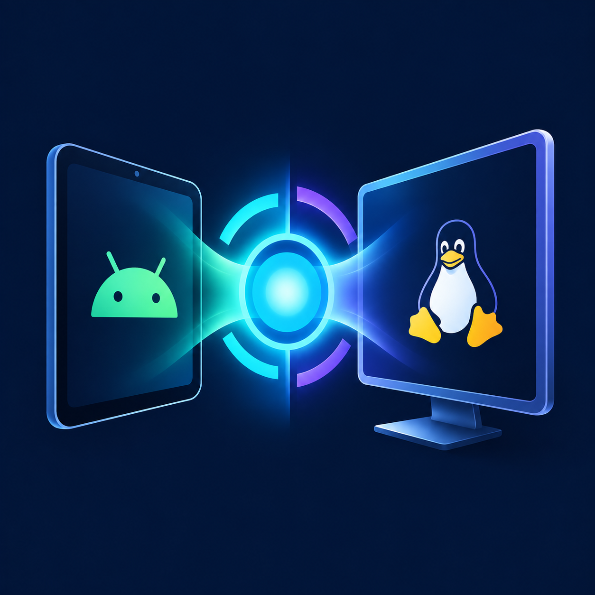

# DroidConverge



The Android home panel shows the latest managed session result together with
live Termux, Anland and Ubuntu/KDE process evidence. `Avvia`, `Ferma` and
guarded `Ripara` are on the first screen; display/peripheral controls and
API tests can be expanded as needed. On RedMagic, an AutoLaunch block may
require opening Termux once before retrying `Avvia`.

The Android Bridge peripheral panel reports USB device, removable storage,
HDMI audio and Wi-Fi/Bluetooth adapter state. A removable drive must first be
mounted by Android before a future Ubuntu chroot mount can be considered; the
panel currently makes no storage or cooler hardware changes. See
`docs/EXTERNAL-DISPLAY.md` for the RedMagic hub check and rollback.

DroidConverge is an integration project for using Android device capabilities from a Linux/Ubuntu desktop session running on Android. The current release focuses on a local Android Bridge, Termux/Anland startup integration, Ubuntu/KDE startup helpers, and Linux haptic integration.

## Current release scope

This checkpoint intentionally freezes the feature set at the current working state.

The `0.5.0-dev` development branch adds an experimental internal display and
session panel after `0.3.0-dev`. On the RedMagic Astra, wireless ADB verified
an independent Android HDMI surface, managed Anland/Plasma lifecycle, and
KDE pixels in the HDMI framebuffer after launching Anland on that display.
The owner confirmed KDE on the physical monitor. The app independently routes
selected physical keyboards/mice to HDMI with Magisk root and restores their
association to the tablet; Android diagnostics verified both transitions.
KDE input delivery, audio playback and hotplug remain unverified. See
`docs/EXTERNAL-DISPLAY.md` for the test and rollback.
The next development build adds a read-only external input inventory and a
Termux installation wizard. See `docs/INSTALLATION.md` for prerequisites,
update behavior and rollback.
The PC/GitHub/tablet reconciliation and future hardware research boundary are
recorded in `docs/RECONCILIATION-2026-09-18.md`.

Included:

- Android Bridge service on `127.0.0.1:8765`
- token-authenticated newline-delimited JSON protocol
- bridge actions for ping, haptic, vibration, battery, Wi-Fi, Bluetooth and notifications
- Termux startup scripts for Anland and Ubuntu/KDE
- Termux Shortcut and Tasker integration
- Ubuntu/KDE startup and tablet/desktop mode helpers
- restart-safe Anland PipeWire/WirePlumber/pipewire-pulse session lifecycle
- DroidConverge haptic integration for Maliit/Plasma Mobile
- reproducible installation and state-collection helpers

Not included yet:

- automatic external-display handling
- Play Store publication workflow
- hardware-specific device support beyond the documented Android/Termux/Ubuntu environment


## Architecture

```text
Linux / Ubuntu / KDE / Plasma Mobile
        |
        | TCP 127.0.0.1:8765 + JSONL + token
        v
DroidConverge Android Bridge
        |
        +-- haptic / vibration
        +-- battery
        +-- Wi-Fi / Bluetooth
        +-- notification
        |
        v
Android framework / rooted system services
```

The Bridge server binds only to loopback. It is not intended to be a network service.

The experimental Anland panel uses `droidconverge-session` in Termux. It
prefers the installed `$PREFIX/bin/start-ubuntu-kde.sh` and falls back to an
executable `~/start-ubuntu-kde.sh`, allowing the reference tablet's local
launcher to remain in place. See `docs/EXTERNAL-DISPLAY.md` for the device
test status and rollback.

## Repository layout

- `DroidConvergeBridge/` — Android application and bridge CLI
- `scripts/termux/` — Termux/Anland startup and helper scripts
- `scripts/ubuntu/` — Ubuntu/KDE startup and mode scripts
- `scripts/install/` — installation entry points
- `integrations/` — Linux-side integration sources
- `configs/` — sanitized example configuration
- `docs/` — setup, architecture, integration and release documentation

## Prerequisites

### Android device

- Android device with USB debugging enabled
- ADB available on the host PC
- for rooted actions: Magisk/root or an equivalent root mechanism
- Termux installed from a trusted source
- Anland/Termux and Ubuntu/chroot-distro installed when using the KDE integration

### PC

- Git
- PowerShell on Windows for the provided Windows installers
- Android SDK/Build Tools appropriate for the Bridge project
- Java/JDK compatible with the Gradle wrapper
- `adb` available to the installer

## Quick start

1. Clone the repository.
2. Build and install the Android Bridge with `scripts/install/install-android-bridge.ps1`.
3. Configure the Bridge token on the Android device.
4. Install the Termux integration with `scripts/install/install-termux.sh`.
5. Install the Ubuntu/KDE helpers with `scripts/install/install-ubuntu.sh`.
6. Create the sanitized Linux-side configuration from `configs/droidconverge.json.example`.
7. Start Anland and Ubuntu/KDE using the Termux shortcut or `start-ubuntu-kde.sh`.
8. Verify the Bridge with the included CLI and haptic test.

Read `docs/INSTALLATION.md` before starting a fresh installation.

## Security

Never commit a real Bridge token, private Android configuration, raw device backups, or personal logs. Only sanitized examples belong in Git.

The Android Bridge listens on loopback, but any local process able to read the token can authenticate to it. Protect the token and local configuration accordingly.

## Disclaimer

DroidConverge is community software. It can require root privileges, modified Android components, custom kernels/drivers, Termux, Anland, chroot containers and locally built Linux components. These changes can affect system stability and device security.

Use the project at your own risk. Test recovery procedures before changing boot, display, graphics, input or privileged services. The project is not affiliated with Android, Google, KDE, Plasma Mobile, Termux, Anland, Magisk or device manufacturers unless explicitly stated.

## Reproducibility policy

The repository is the reproducible source of truth. Device checkpoints are recovery material only. When importing work from a checkpoint:

1. inventory it;
2. compare it with Git;
3. import only project files;
4. exclude personal data, tokens and generated artifacts;
5. verify the installation from a clean checkout;
6. only then tag or publish a release.

## Status

See:

- `docs/PROJECT-STATUS.md`
- `docs/INSTALLATION.md`
- `docs/TERMUX-INTEGRATION.md`
- `docs/TROUBLESHOOTING-AUDIO.md`
- `docs/integrations/LINUX-HAPTICS.md`
- `docs/RELEASE-PREFLIGHT.md`
- `docs/RELEASE-0.3.0.md`
- `docs/EXTERNAL-DISPLAY.md`
# Current development status

Version `0.5.1-dev` introduces the first localization pass. English is the fallback language; Italian, French, Spanish and Portuguese cover the primary navigation and session/display controls. Remaining diagnostic detail strings will move to resources incrementally.

The Sessione tab also shows detected hardware temperatures and internal fan state as read-only whole-device measurements. Fan speed controls remain disabled until their semantics and rollback are validated on NP05J.

Development now includes three independent KDE profiles (Tablet Touch, Tablet Desktop, Monitor Desktop), a generated KDE menu for launchable Android apps, Android-owned radio controls, an ARM64 software-store setup and guarded gaming experiments. See [gaming and Android apps](docs/GAMING-AND-ANDROID-APPS.md). GPU percentage is the tablet-wide KGSL counter; per-chroot GPU attribution is not claimed.

The 2026-09-19 RedMagic test exercised all three scale profiles, generated 64 Android launchers, opened an Android app from KDE and read Wi-Fi/Bluetooth status. Chrome ARM64 verified Freedreno/Turnip acceleration and working YouTube on Wayland. The Box64/Steam experiment reached a client process but exposed synchronization failures and has been retired: Ubuntu targets native ARM64 applications, while x86/Windows gaming remains an Android GameHub use case. Qualcomm video decode was detected but failed FFmpeg buffer allocation, so the generic FFmpeg path is not advertised as working.

The Android panel now has Sessione, Schermo e I/O, Installa and Avanzate tabs, live chroot CPU/RAM estimates, and a RedMagic Astra KScreen scale profile. The HDMI profile uses 100% Desktop; the tablet profile defaults to 170% Touch and can be changed in the app. USB keyboard/mouse routes can temporarily keep their device awake and restore the earlier power setting. See [external display tests](docs/EXTERNAL-DISPLAY.md) and [project status](docs/PROJECT-STATUS.md) for verified behavior and open limits. The installer is guided setup for an existing rooted chroot system; clean-device installation is still in progress.
